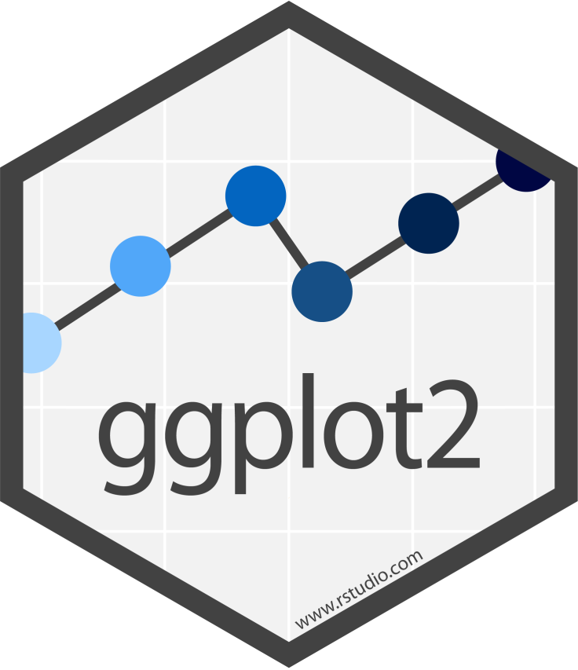
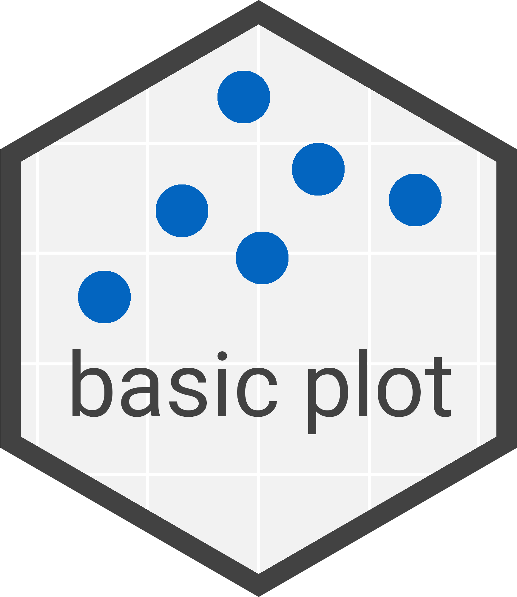
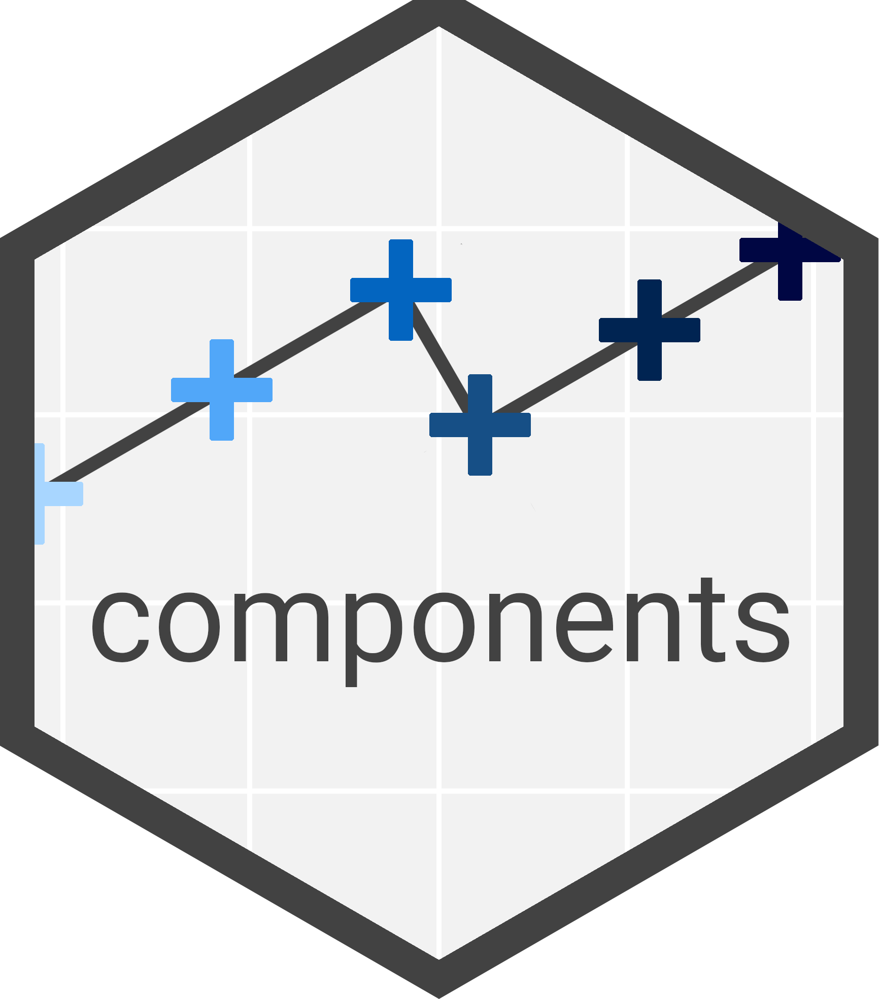
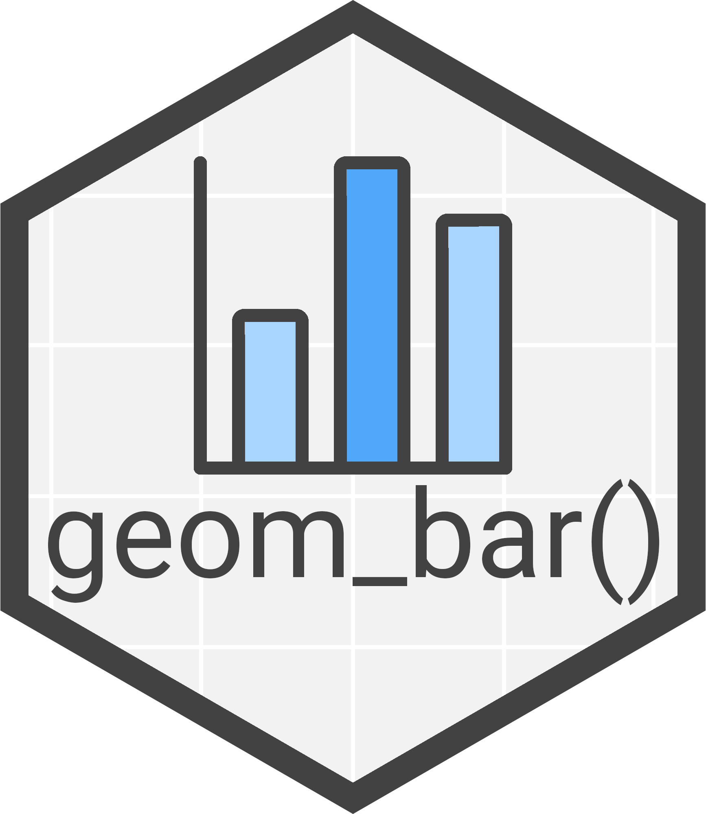
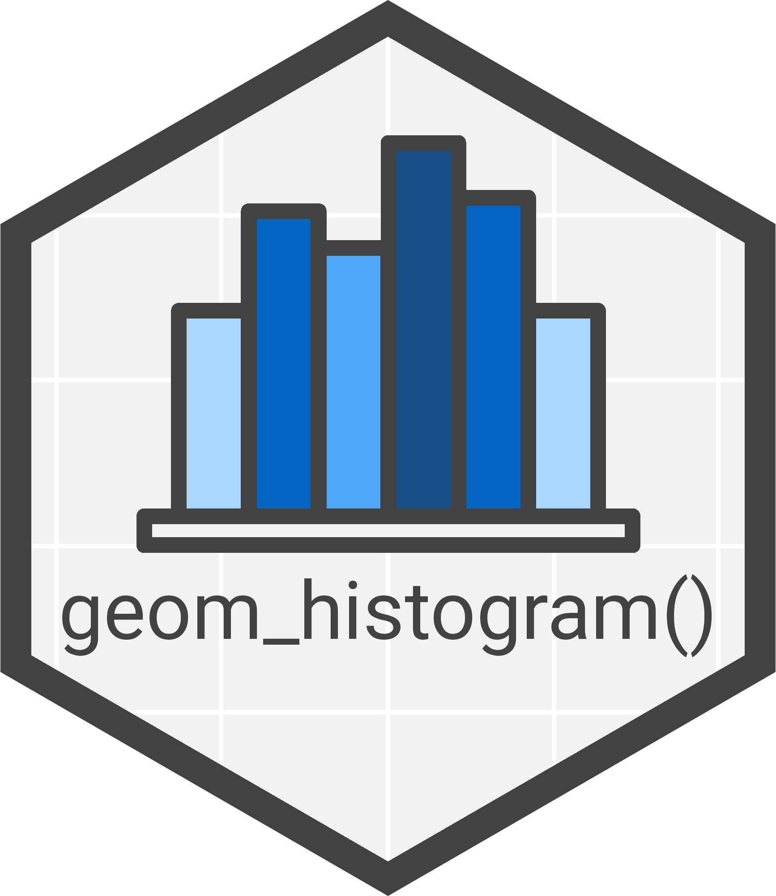
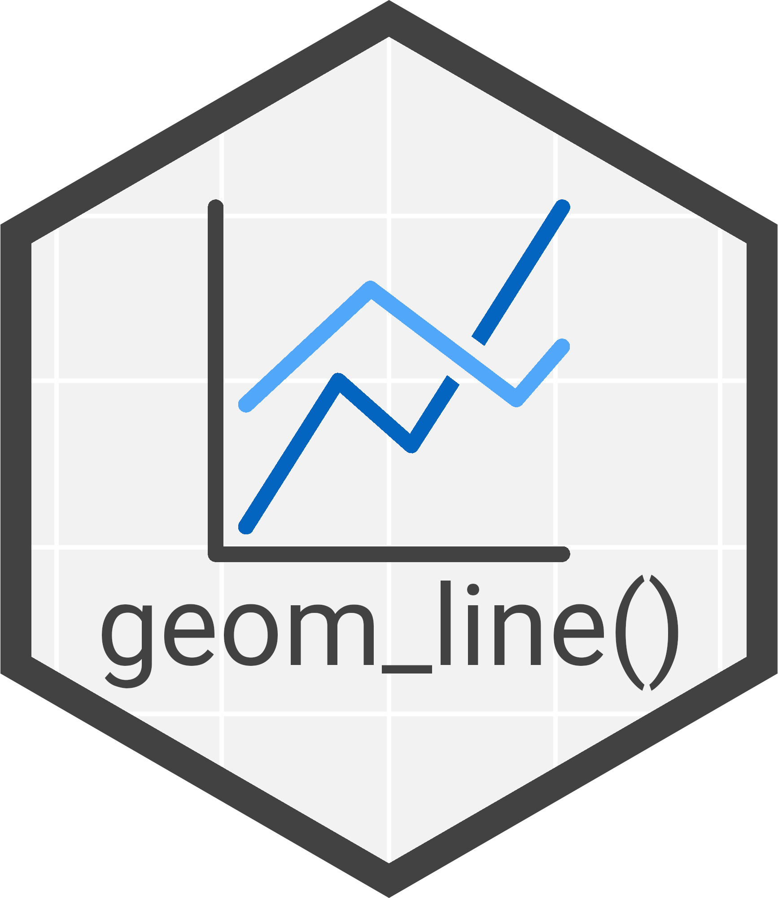
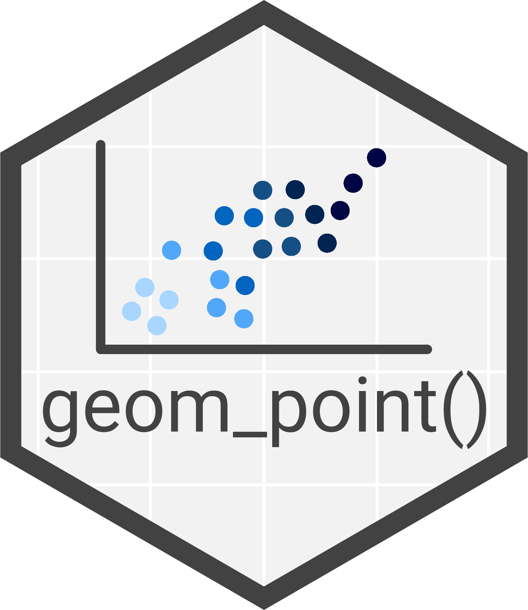
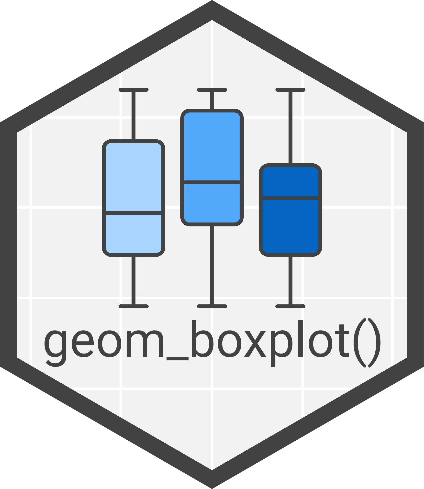
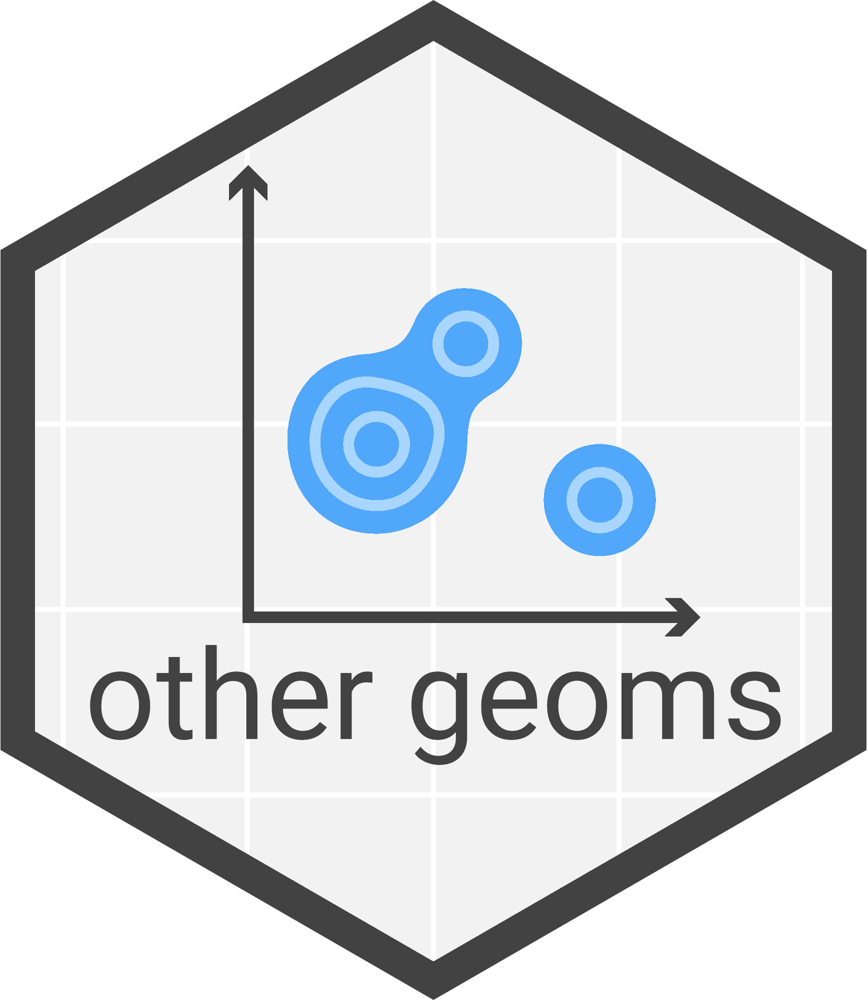

```{r setup, include=FALSE}
library(learnr)
learnr::tutorial_options(exercise.completion = FALSE)
library(tidyverse)
library(lterdatasampler)
library(mgrtibbles)
library(hexbin)
knitr::opts_chunk$set(echo = FALSE)
tutorial_options(exercise.timelimit = 300)
```

## ggplot2

<center>
{style="width:150px"}
</center>

This tutorial covers the `ggplo2` package.

[Tidyverse ggplot2 page](https://neof-workshops.github.io/Tidyverse/ggplot2/ggplot2.html)

## Anatomy

<center>{style="width:150px"} {style="width:150px"} </center>

<center>{style="width:150px"} {style="width:150px"} </center>

This first section will focus on the anatomy of a `ggplot2`.
This acts as an introduction to `ggplot2`.

There is a lot of information in our tidyverse website so through these parts we will ask you to read the relevant part.
Then we will reinforce that learning with MCQs (Multiple Choice Questions) and some coding challenges.

## Basic plot
<center>
{style="width:150px"}
</center>

Read through the below web page:

[Basic plot](https://neof-workshops.github.io/Tidyverse/ggplot2/basic_plot.html)

### Quiz & challenge

Attempt the below questions.

```{r basic-plot-1-mcq, echo=FALSE}
question("Which symbol is used to add components to a `ggplot` object?",
  answer("`<-`"),
  answer("`|>`"),
  answer("`+`", correct = TRUE),
  allow_retry = TRUE
)
```

```{r basic-plot-2-mcq, echo=FALSE}
question("What is the order of the first 2 parameters in the `ggplot` function?",
  answer("`data=, mapping=`", correct = TRUE),
  answer("`mapping=, data=`"),
  allow_retry = TRUE
)
```

Complete the below code by:

- Adding the `Year` column as the __x__ aesthetic
- Adding the `Population` column as the __y__ aesthetic
- Adding the `ggplot2::geom_line()` layer as the last component to create a line chart

```{r basic-plot-exercise, exercise=TRUE, exercise.eval=FALSE, out.width="100%"}
world_pop_tbl |>
  #Filter to only retain Australia rows
  dplyr::filter(`Country/Territory` == "Australia") |>
  #Convert Year column to numeric for plotting
  dplyr::mutate(Year=as.numeric(Year)) |>
  #ggplot object
  ggplot2::ggplot(aes())
```

```{r basic-plot-exercise-solution}
world_pop_tbl |>
  #Filter to only retain Australia rows
  dplyr::filter(`Country/Territory` == "Australia") |>
  #Convert Year column to numeric for plotting
  dplyr::mutate(Year=as.numeric(Year)) |>
  #ggplot object
  ggplot2::ggplot(aes(x = Year, y = Population)) +
  #Line component/layer
  ggplot2::geom_line()
```

Excellent!
Now to look at the input data for `ggplot2`.

## Input data
<center>
{style="width:150px"}
</center>

Read through the below web page:

[Input data](https://neof-workshops.github.io/Tidyverse/ggplot2/input_data.html)

### Quiz & challenge

Attempt the below questions.

```{r input-1-mcq, echo=FALSE}
question("In long/tidy data, what is each column?",
  answer("An observation"),
  answer("A value"),
  answer("A variable", correct = TRUE),
  allow_retry = TRUE
)
```

```{r input-2-mcq, echo=FALSE}
question("In long/tidy data, what is each row?",
  answer("An observation", correct = TRUE),
  answer("A value"),
  answer("A variable"),
  allow_retry = TRUE
)
```

```{r input-3-mcq, echo=FALSE}
question("In long/tidy data, what is each cell?",
  answer("An observation"),
  answer("A value", correct = TRUE),
  answer("A variable"),
  allow_retry = TRUE
)
```

Great!
Next we'll cover aesthetics.

## Aesthetics
<center>
{style="width:150px"}
</center>

Read through the below web page:

[Aesthetics](https://neof-workshops.github.io/Tidyverse/ggplot2/aesthetics.html)

### Quiz & challenge

Attempt the below questions.
All correct options must be chosen in the below questions.

```{r aes-1-mcq, echo=FALSE}
question("Which aesthetics should only be used for continuous variables?",
  answer("color"),
  answer("fill"),
  answer("linetype"),
  answer("linewidth", correct=TRUE),
  answer("shape"),
  answer("size", correct=TRUE),
  answer("x"),
  answer("y"),
  allow_retry = TRUE
)
```

```{r aes-2-mcq, echo=FALSE}
question("Which aesthetics should only be used for categorical variables?",
  answer("color"),
  answer("fill"),
  answer("linetype", correct=TRUE),
  answer("linewidth"),
  answer("shape", correct=TRUE),
  answer("size"),
  answer("x"),
  answer("y"),
  allow_retry = TRUE
)
```

```{r aes-3-mcq, echo=FALSE}
question("Which aesthetics can be used for categorical or continuous variables?",
  answer("color", correct=TRUE),
  answer("fill", correct=TRUE),
  answer("linetype"),
  answer("linewidth"),
  answer("shape"),
  answer("size"),
  answer("x", correct=TRUE),
  answer("y", correct=TRUE),
  allow_retry = TRUE
)
```

Super!
Now it is time to look at components.

## Components
<center>
{style="width:150px"}
</center>

Read through the below web page:

[Components](https://neof-workshops.github.io/Tidyverse/ggplot2/components.html)

### Challenges

The below challenges will all involve adding components to a `ggplot` object to add complexity.

### Challenge 1

Create a scatter plot of `leaf1area` on the x axis and `leaf2area` on the y axis for the tibble `hbrmaples`.

You will need to add the component `ggplot2::geom_pont()` to the below code.

__Extra:__ Before creating the `ggplot` object remove rows with `NA`s. 

```{r component-1-exercise, exercise=TRUE, exercise.eval=FALSE, out.width="100%"}
hbr_maples |>
  ggplot2::ggplot(aes(x=leaf1area, y=leaf2area))
```

```{r component-1-exercise-solution}
hbr_maples |>
  #Remove rows with NAs
  tidyr::drop_na() |>
  #Point plot of leaf1area (x) against leaf2area (y)
  ggplot2::ggplot(aes(x=leaf1area, y=leaf2area)) +
  ggplot2::geom_point()
```

### Challenge 2

Add a box plot component (`ggplot2::geom_boxplot()`) to the below plot, ensuring the points are on top of the boxes.

__Extra:__ Change `geom_point()` to `geom_jitter()`.

```{r component-2-exercise, exercise=TRUE, exercise.eval=TRUE, out.width="100%"}
hbr_maples |>
  #Remove rows with NAs
  tidyr::drop_na() |>
  #Ggplot of stem_length (y) against watershed (x)
  ggplot2::ggplot(aes(x=watershed, y=stem_length)) +
  ggplot2::geom_point()
```

```{r component-2-exercise-solution}
hbr_maples |>
  #Remove rows with NAs
  tidyr::drop_na() |>
  #Ggplot of stem_length (y) against watershed (x)
  ggplot2::ggplot(aes(x=watershed, y=stem_length)) +
  #Boxplot
  ggplot2::geom_boxplot() +
  #Jitter points (on top of box plots)
  ggplot2::geom_jitter()
```

Brilliant!
That's the introduction to `ggplot2` done its time to look at various layers.

## Layers

<center>
{style="width:150px"} 
{style="width:150px"} 
{style="width:150px"}
</center>

<center>{style="width:150px"} {style="width:150px"} {style="width:150px"}</center>

Layers are vital for `ggplot2`, without them your data will not be visualised.
There are many different types all with strengths and weaknesses.
This tutorial will focus on how to use them not the when and whys.

### Exercises

This following 6 sections are challenges.
You will need to reference our [tidyverse website](https://neof-workshops.github.io/Tidyverse/ggplot2/ggplot2.html) to find the correct functions and their usage.

The challenges will be creating:

- A Bar chart with [`geom_bar()`](https://neof-workshops.github.io/Tidyverse/ggplot2/geom_bar.html)
- A Histogram with [`geom_histogram()`](https://neof-workshops.github.io/Tidyverse/ggplot2/geom_histogram.html)
- A Line chart with [`geom_line()`](https://neof-workshops.github.io/Tidyverse/ggplot2/geom_line.html)
- A Scatter plot with [`geom_point()`](https://neof-workshops.github.io/Tidyverse/ggplot2/geom_point.html)
- A Box plot with [`geom_boxplot()`](https://neof-workshops.github.io/Tidyverse/ggplot2/geom_boxplot.html)
- A Hexagonal 2D bin count heatmap with [`geom_hex()`](https://neof-workshops.github.io/Tidyverse/ggplot2/geom_others.html)

Additionally, each challenges will have an __extra optional__ task.
These are __optional__ and you will need to reference the web pages in the [`ggplot2` customisation section](https://neof-workshops.github.io/Tidyverse/ggplot2/ggplot2.html#customisation) if you want to complete them.

## Bar chart
<center>
{style="width:150px"}
</center>

Create a bar chart with `mushroom_tbl` showing the relative proportions of the different cap shapes across the different cap colors.

In other words:

- Use the tibble `mushroom_tbl` to create a `ggplot` object
- Use `cap_color` as the __x__ aesthetic
- Use `cap_shape` as the __fill__ aesthetic
- Use `geom_bar()` as the `ggplot` layer
- Set the option `position=` in `geom_bar()` so it displays relative proportions

[Tidyverse `geom_bar()` page](https://neof-workshops.github.io/Tidyverse/ggplot2/geom_bar.html)

### Code

```{r bar-chart-exercise, exercise=TRUE, exercise.eval=FALSE, out.width="100%"}
mushroom_tbl
```

```{r bar-chart-exercise-solution}
mushroom_tbl |>
  ggplot2::ggplot(aes(x=cap_color, fill=cap_shape)) +
  #Relative proportion bar chart
  ggplot2::geom_bar(position="fill")
```

## Histogram
<center>
{style="width:150px"} 
</center>

Create a histogram with `and_vertebrates` of weight counts with bin sizes of 5.
Ensure `NA` values in the `weight_g` column are not included.

In other words:

- Use the tibble `and_vertebrates` to create a `ggplot` object
- Drop rows with `NA`s in the `weight_g` column (requires a [`tidyr` function](https://neof-workshops.github.io/Tidyverse/tidyr/tidyr.html))
- Use `weight_g` as the __x__ aesthetic
- Use `geom_histogram()` as the `ggplot` layer
- Set the option `binwidth=` in `geom_histogram()` to __5__

[Tidyverse `geom_histogram()` page](https://neof-workshops.github.io/Tidyverse/ggplot2/geom_histogram.html)

### Code

```{r histogram-exercise, exercise=TRUE, exercise.eval=FALSE, out.width="100%"}
and_vertebrates
```

```{r histogram-exercise-solution}
and_vertebrates |>
  #Remove rows with NAs in weight_g column
  tidyr::drop_na(weight_g) |>
  #ggplot histogram of weight counts
  ggplot2::ggplot(aes(x=weight_g)) +
  #Bin width set to 5
  ggplot2::geom_histogram(binwidth=5)
```

## Line chart
<center>
{style="width:150px"}
</center>

Create a line chart with `living_planet_tbl` plotting the Average Living Planet Index (y) against the year (x) with the lines coloured by Region.

In other words:

- Use the tibble `living_planet_tbl` to create a `ggplot` object
- Use `Year` as the __x__ aesthetic
- Use `Average Index` as the __fill__ aesthetic
  - Remeber to use backticks (`` ` ``) when using column names with spaces
- Use `Region` ad the __color__ aesthetic
- Use `geom_line()` as the `ggplot` layer

[Tidyverse `geom_line()` page](https://neof-workshops.github.io/Tidyverse/ggplot2/geom_line.html)

### Code

```{r line-chart-exercise, exercise=TRUE, exercise.eval=FALSE, out.width="100%"}
living_planet_tbl
```

```{r line-chart-exercise-solution}
living_planet_tbl |>
  #ggplot line chart of average index (y) against Year (x) split by Region
  ggplot(aes(x=Year, y=`Average Index`, colour=Region)) +
  geom_line()
```

## Scatter plot
<center>
{style="width:150px"}
</center>

Create a scatter pot with `crab_age_pred_tbl` plotting height (y) against length (x) with the points coloured by sex.

In other words:

- Use the tibble `crab_age_pred_tbl` to create a `ggplot` object
- Use `Length` as the __x__ aesthetic
- Use `Height` as the __y__ aesthetic
- Use `Sex` as the __color__ aesthetic
- Use `geom_point()` as the `ggplot` layer

[Tidyverse `geom_point()` page](https://neof-workshops.github.io/Tidyverse/ggplot2/geom_point.html)

### Code

```{r point-exercise, exercise=TRUE, exercise.eval=FALSE, out.width="100%"}
crab_age_pred_tbl
```

```{r point-exercise-solution}
crab_age_pred_tbl |>
  #ggplot point chart of Height (y) against Length (x) coloured by sex
  ggplot2::ggplot(aes(x=Length, y=Height, color=Sex)) +
  ggplot2::geom_point()
```

## Boxplot
<center>
{style="width:150px"}
</center>

Create a flipped boxplot with `amphibian_div_tbl` plotting boxes of body size across families.

In other words:

- Use the tibble `amphibian_div_tbl` to create a `ggplot` object
- Use `Body_size_mm` as the __x__ aesthetic
- Use `Family` as the __y__ aesthetic
- Use `geom_boxplot()` as the `ggplot` layer

[Tidyverse `geom_boxplot()` page](https://neof-workshops.github.io/Tidyverse/ggplot2/geom_boxplot.html)

### Code

```{r boxplot-exercise, exercise=TRUE, exercise.eval=FALSE, out.width="100%"}
amphibian_div_tbl
```

```{r boxplot-exercise-solution}
amphibian_div_tbl |>
  #ggplot flipped boxplot of Body size across families
  ggplot2::ggplot(aes(x=Body_size_mm,y=Family)) +
  ggplot2::geom_boxplot()
```

## Other geoms
<center>
{style="width:150px"}
</center>

Create a hexagonal 2D bin count heatmap of `mushroom_tbl` plotting the counts of different stem heights against stem width.

In other words:

- Use the tibble `mushroom_tbl` to create a `ggplot` object
- Use `stem_width` as the __x__ aesthetic
- Use `stem_height` as the __y__ aesthetic
- Use `geom_hex()` as the `ggplot` layer

[Tidyverse other geoms page](https://neof-workshops.github.io/Tidyverse/ggplot2/geom_others.html)

### Code

```{r hex2d-exercise, exercise=TRUE, exercise.eval=FALSE, out.width="100%"}
mushroom_tbl
```

```{r hex2d-exercise-solution}
mushroom_tbl |>
  ggplot2::ggplot(aes(x=stem_width, y=stem_height)) +
  ggplot2::geom_hex()
```


## Building complexity

A great advantage of `ggplot2` is the ability to add components and options to gradually increase the complexity of plots.

## Challenges

To finish off this tutorial you will use all you have learnt to improve the plots you created when learning the different layers.

Each challenge will have the final code for the previous plots you created.
You will need to follow the instructions to edit and add components to the code.
Additionally, you will need to pipe the data into `dplyr` and `tidyr` functions before the `ggplot` creation for some of the challenges.

This tutorial aims to make you familiar with `tidyverse` and our [Tidyverse website](https://neof-workshops.github.io/Tidyverse/).
Please use our site as a reference and feel free to copy, paste, and edit the code from it.

### Bar chart

Change the colours used for the __fill__ aesthetic to the Wong palette shown in the [Colour scales page](https://neof-workshops.github.io/Tidyverse/ggplot2/colour_scales.html).

```{r bar-chart-extra-exercise, exercise=TRUE, exercise.eval=FALSE, out.width="100%"}
mushroom_tbl |>
  ggplot2::ggplot(aes(x=cap_color, fill=cap_shape)) +
  #Relative proportion bar chart
  ggplot2::geom_bar(position="fill")
```

```{r bar-chart-extra-exercise-solution}
#Wong palette
wong_pal <- c("#e69f00","#56b4e9","#009e73","#f0e442",
                "#0072b2","#d55e00","#cc79a7","#000000")
##ggplot
mushroom_tbl |>
  ggplot2::ggplot(aes(x=cap_color, fill=cap_shape)) +
  #Relative proportion bar chart
  ggplot2::geom_bar(position="fill") +
  #Wong palette for fill
  ggplot2::scale_fill_manual(values = wong_pal)
```

### Histogram

Carry out the following:

- Set the __color__ aesthetic to `species`
- Change the __layer__ from a histogram to a __frequency polygon__
  - Keep the bin width value as 5
- Change the __x__ label to "Weight (grams)"

```{r histogram-extra-exercise, exercise=TRUE, exercise.eval=FALSE, out.width="100%"}
and_vertebrates |>
  #Remove rows with NAs in weight_g column
  tidyr::drop_na(weight_g) |>
  #ggplot histogram of weight counts
  ggplot2::ggplot(aes(x=weight_g)) +
  #Bin width set to 5
  ggplot2::geom_histogram(binwidth=5)
```

```{r histogram-extra-exercise-solution}
and_vertebrates |>
  #Remove rows with NAs in weight_g column
  tidyr::drop_na(weight_g) |>
  #ggplot histogram of weight counts
  ggplot2::ggplot(aes(x=weight_g, color=species)) +
  #Bin width set to 5
  ggplot2::geom_freqpoly(binwidth=5) +
  #X label set
  ggplot2::labs(x = "Weight (grams)")
```

### Line chart

Carry out the following:

- Change the __layer__ from a normal line chart to a __steps__ line chart
- Set the __legend text size__ to __8__
- Set the __legend position__ to the __bottom__ of the plot 

```{r line-chart-extra-exercise, exercise=TRUE, exercise.eval=FALSE, out.width="100%"}
living_planet_tbl |>
  #ggplot line chart of average index (y) against Year (x) split by Region
  ggplot(aes(x=Year, y=`Average Index`, colour=Region)) +
  geom_line()
```

```{r line-chart-extra-exercise-solution}
living_planet_tbl |>
  #ggplot step chart of average index (y) against Year (x) split by Region
  ggplot(aes(x=Year, y=`Average Index`, colour=Region)) +
  geom_step() +
  #Add a plot title
  labs(title="Living Planet Index") +
  #Set size of legend text and set position to bottom of plot
  theme(legend.text = ggplot2::element_text(size=8),
        legend.position="bottom")
```

### Scatter plot

Carry out the following:

- Remove rows where `Height` is equal to 0
- Change the __color__ aesthetic to `Age`
- __Facet grid__ the plot by __rows__ using the `Sex` variable
- Scale transform the __y__ axis by __log10__

```{r point-extra-exercise, exercise=TRUE, exercise.eval=FALSE, out.width="100%", fig.height=6}
crab_age_pred_tbl |>
  ggplot2::ggplot(aes(x=Length, y=Height, color=Sex)) +
  ggplot2::geom_point()
```

```{r point-extra-exercise-solution}
crab_age_pred_tbl |>
  #Remove rows/observations where Height equals 0
  #To avoid warnings from the scale transformation
  dplyr::filter(Height != 0) |>
  #ggplot point chart of Height (y) against Length (x) coloured by sex
  ggplot2::ggplot(aes(x=Length, y=Height, color=Age)) +
  ggplot2::geom_point() +
  #Facet grid by rows using the Sex variable
  ggplot2::facet_grid(rows=dplyr::vars(Sex)) +
  #Scale the y axis by log10
  ggplot2::scale_y_log10()
```

### Boxplot

Carry out the following:

- Drop rows where the `iucn_2cat` value is `NA`
- Set `Family` to the __x__ aesthetic
- Set `Body_size_mm` to the __y__ aesthetic
- Discard outliers from the boxplot
  - You will need to look at the [official tidyverse `geom_boxplot()` page](https://ggplot2.tidyverse.org//reference/geom_boxplot.html)
- Add the `geom_jitter()` layer and colour these points by `iucn_2cat`.
- Make the __x axis labels dodge__ each other
  - Use 3 rows to dodge

```{r boxplot-extra-exercise, exercise=TRUE, exercise.eval=FALSE, out.width="100%"}
amphibian_div_tbl |>
  ggplot2::ggplot(aes(y=Family,x=Body_size_mm)) +
  ggplot2::geom_boxplot()
```

```{r boxplot-extra-exercise-solution}
amphibian_div_tbl |>
  #Drop rows where iucn_2cat is NA
  tidyr::drop_na(iucn_2cat) |>
  #ggplot boxplot of Body size acorss families
  ggplot2::ggplot(aes(x=Family,y=Body_size_mm)) +
  #Boxplot ensuring outliers are removed
  ggplot2::geom_boxplot(outliers=FALSE) +
  #Jitter points coloured by iucn_2cat
  ggplot2::geom_jitter(aes(color=iucn_2cat)) +
  #Set 3 rows for x axis label dodging
  ggplot2::guides(x = ggplot2::guide_axis(n.dodge = 3))
```

### Other geoms

Create a hexagonal 2D bin count heatmap of `mushroom_tbl` plotting the counts of different stem heights against stem width.

In other words:

- Use the tibble `mushroom_tbl` to create a `ggplot` object
- Use `stem_width` as the __x__ aesthetic
- Use `stem_height` as the __y__ aesthetic
- Use `geom_hex()` as the `ggplot` layer

[Tidyverse other geoms page](https://neof-workshops.github.io/Tidyverse/ggplot2/geom_others.html)

```{r hex2d-extra-exercise, exercise=TRUE, exercise.eval=FALSE, out.width="100%"}
mushroom_tbl |>
  ggplot2::ggplot(aes(x=stem_width, y=stem_height)) +
  ggplot2::geom_hex() +
  
```

```{r hex2d-extra-exercise-solution}
mushroom_tbl |>
  dplyr::filter(class=="poisonous") |>
  ggplot2::ggplot(aes(x=stem_width, y=stem_height)) +
  ggplot2::geom_hex(binwidth=2) +
  #Fixed aspect ratio
  #Ensure hex sides are all equal length
  ggplot2::coord_fixed(ratio=1) +
  ggplot2::labs(x="Stem width (cm)", y = "Stem height (cm)",
                title="Count of stem height against stem width of poisonous mushrooms") +
  ggplot2::theme(legend.position="bottom")
```
